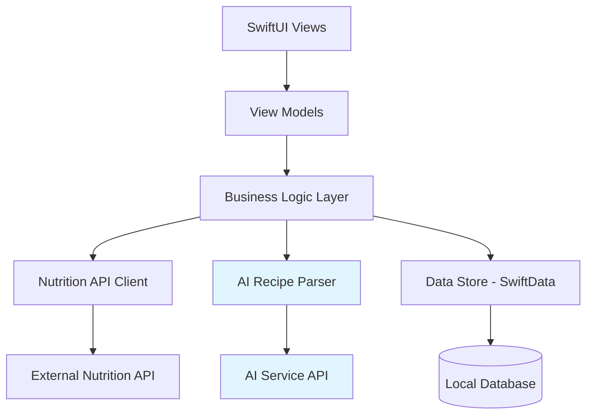

# Design Document: AI-Powered Recipe Tracking

## Overview

The AI-Powered Recipe Tracking feature extends the CountMe calorie tracking system to support complex, multi-ingredient meals through natural language recipe descriptions. Users can describe recipes (e.g., "chicken stir fry with rice and vegetables"), have an AI service parse them into structured ingredient lists with full nutritional data (calories, protein, carbs, fats), and save these as reusable custom meals.

This feature integrates seamlessly with the existing FoodItem and DailyLog models while adding macro tracking capabilities across the entire application. The architecture maintains the same actor-based persistence patterns, data validation rules, and offline-first approach established in the calorie tracking feature.

Key capabilities include:
- Natural language recipe parsing via AI service
- Reusable custom meal templates with multiple ingredients
- Full macro tracking (protein, carbohydrates, fats) for all food items
- Serving size adjustments with proportional nutritional recalculation
- Offline access to saved custom meals
- Search and filtering of custom meal library

**Related Documentation:**
- [API Documentation](api-documentation.md) - Comprehensive API reference with usage examples
- [Requirements Document](requirements.md) - User stories and acceptance criteria
- [Tasks Document](tasks.md) - Implementation plan and testing strategy

## Architecture

### High-Level Architecture



### Layer Responsibilities

**Presentation Layer (SwiftUI Views)**
- Display custom meals library with search and filtering
- Render recipe input form for AI parsing
- Show ingredient breakdown with macro information
- Provide serving size adjustment interface
- Display macro totals alongside calorie totals in daily logs

**View Model Layer**
- Manage custom meal creation and editing state
- Format nutritional data (calories and macros) for display
- Coordinate AI parsing requests and handle loading states
- Handle serving size calculations and UI updates

**Business Logic Layer**
- Parse AI service responses into structured ingredient data
- Calculate total nutritional values for custom meals
- Apply serving size multipliers to all nutritional values
- Validate ingredient data (non-negative values, required fields)
- Manage custom meal lifecycle (create, edit, delete, reuse)

**Data Access Layer**
- AI Recipe Parser client for natural language processing
- Extended DataStore for custom meal persistence
- Nutrition API client (existing, for ingredient lookup fallback)
- Data transformation between AI responses and local models

### Integration with Existing System

**FoodItem Model Extension:**
- Add optional macro fields (protein, carbs, fats) to existing FoodItem
- Maintain backward compatibility with existing food items
- New FoodItemSource case: `.customMeal` for AI-generated ingredients

**DailyLog Enhancement:**
- Computed properties for total macros across all food items
- Display macro breakdown alongside calorie totals
- No schema changes required (uses existing foodItems relationship)

**DataStore Extension:**
- New methods for custom meal CRUD operations
- Maintain existing actor-based concurrency patterns
- Separate persistence for custom meal templates vs. meal instances

## Components and Interfaces

### Extended Data Models

**FoodItem (Extended)**
```swift
@Model
class FoodItem {
    var id: UUID
    var name: String
    var calories: Double
    var timestamp: Date
    var servingSize: String?
    var servingUnit: String?
    var source: FoodItemSource
    
    // New macro fields (optional for backward compatibility)
    var protein: Double?      // grams
    var carbohydrates: Double? // grams
    var fats: Double?         // grams
    
    init(id: UUID = UUID(), 
         name: String, 
         calories: Double, 
         timestamp: Date = Date(),
         servingSize: String? = nil,
         servingUnit: String? = nil,
         source: FoodItemSource = .manual,
         protein: Double? = nil,
         carbohydrates: Double? = nil,
         fats: Double? = nil)
}

enum FoodItemSource: String, Codable {
    case api
    case manual
    case customMeal  // New case for AI-generated ingredients
}
```

**CustomMeal (New)**
```swift
@Model
class CustomMeal {
    var id: UUID
    var name: String
    var ingredients: [Ingredient]
    var createdAt: Date
    var lastUsedAt: Date
    var servingsCount: Double  // Base serving size (default 1.0)
    
    // Computed totals across all ingredients
    var totalCalories: Double {
        ingredients.reduce(0) { $0 + $1.calories }
    }
    
    var totalProtein: Double {
        ingredients.reduce(0) { $0 + ($1.protein ?? 0) }
    }
    
    var totalCarbohydrates: Double {
        ingredients.reduce(0) { $0 + ($1.carbohydrates ?? 0) }
    }
    
    var totalFats: Double {
        ingredients.reduce(0) { $0 + ($1.fats ?? 0) }
    }
    
    init(id: UUID = UUID(),
         name: String,
         ingredients: [Ingredient],
         createdAt: Date = Date(),
         lastUsedAt: Date = Date(),
         servingsCount: Double = 1.0)
}
```

**Ingredient (New)**
```swift
@Model
class Ingredient {
    var id: UUID
    var name: String
    var quantity: Double
    var unit: String
    var calories: Double
    var protein: Double?
    var carbohydrates: Double?
    var fats: Double?
    
    init(id: UUID = UUID(),
         name: String,
         quantity: Double,
         unit: String,
         calories: Double,
         protein: Double? = nil,
         carbohydrates: Double? = nil,
         fats: Double? = nil)
}
```

**DailyLog (Extended with Computed Properties)**
```swift
extension DailyLog {
    var totalProtein: Double {
        foodItems.reduce(0) { $0 + ($1.protein ?? 0) }
    }
    
    var totalCarbohydrates: Double {
        foodItems.reduce(0) { $0 + ($1.carbohydrates ?? 0) }
    }
    
    var totalFats: Double {
        foodItems.reduce(0) { $0 + ($1.fats ?? 0) }
    }
}
```

### New Business Logic Components

**CustomMealManager**
```swift
@Observable
class CustomMealManager {
    private let dataStore: DataStore
    private let aiParser: AIRecipeParser
    
    var savedMeals: [CustomMeal] = []
    var isLoading: Bool = false
    var errorMessage: String?
    
    // Recipe parsing
    func parseRecipe(description: String) async throws -> ParsedRecipe
    
    // Custom meal CRUD
    func saveCustomMeal(name: String, ingredients: [Ingredient]) async throws -> CustomMeal
    func updateCustomMeal(_ meal: CustomMeal) async throws
    func deleteCustomMeal(_ meal: CustomMeal) async throws
    func loadAllCustomMeals() async throws
    
    // Meal usage
    func addCustomMealToLog(_ meal: CustomMeal, 
                            servingMultiplier: Double,
                            log: DailyLog) async throws -> [FoodItem]
    
    // Search and filtering
    func searchCustomMeals(query: String) -> [CustomMeal]
}
```

**AIRecipeParser**
```swift
actor AIRecipeParser {
    private let session: URLSession
    private let apiKey: String
    private let endpoint: URL
    
    func parseRecipe(description: String) async throws -> ParsedRecipe
}

struct ParsedRecipe {
    let ingredients: [ParsedIngredient]
    let confidence: Double  // 0.0 to 1.0
}

struct ParsedIngredient {
    let name: String
    let quantity: Double
    let unit: String
    let calories: Double
    let protein: Double?
    let carbohydrates: Double?
    let fats: Double?
}

enum AIParserError: Error {
    case invalidResponse
    case networkError(Error)
    case parsingFailed
    case timeout
    case insufficientData
}
```

**DataStore (Extended)**
```swift
extension DataStore {
    // Custom meal operations
    func fetchAllCustomMeals() async throws -> [CustomMeal]
    func fetchCustomMeal(id: UUID) async throws -> CustomMeal?
    func saveCustomMeal(_ meal: CustomMeal) async throws
    func updateCustomMeal(_ meal: CustomMeal) async throws
    func deleteCustomMeal(_ meal: CustomMeal) async throws
    
    // Search operations
    func searchCustomMeals(query: String) async throws -> [CustomMeal]
}
```

### New View Components

**CustomMealsLibraryView**
- Search bar with real-time filtering
- List of saved custom meals with nutritional summaries
- Tap to view detailed ingredient breakdown
- Swipe-to-delete for meal removal
- Add button to create new custom meal
- Empty state with helpful messaging
- Sort by most recently used

**RecipeInputView**
- Multi-line text field for recipe description
- "Parse Recipe" button to trigger AI processing
- Loading indicator during AI request
- Error display with retry option
- Manual ingredient entry fallback button
- Example prompts to guide user input

**IngredientReviewView**
- List of parsed ingredients with editable fields
- Name, quantity, unit, and nutritional values per ingredient
- Add/remove ingredient buttons
- Total nutritional summary at top
- Save button to create custom meal
- Cancel button to discard
- Validation error display

**CustomMealDetailView**
- Meal name and creation date
- Full ingredient list with quantities
- Total nutritional breakdown (calories, protein, carbs, fats)
- Serving size adjustment slider/stepper
- Real-time recalculation of nutritional values
- "Add to Today" button
- Edit and delete options

**MacroDisplayView (Reusable Component)**
- Horizontal bar chart or circular progress for macros
- Color-coded sections (protein: blue, carbs: green, fats: orange)
- Numeric values with units (grams)
- Percentage of daily goals (if set)
- Used in daily log view and custom meal views

## Data Models

### Persistence Strategy

**SwiftData Models:**
- `FoodItem`: Extended with optional macro fields
- `DailyLog`: Existing model with computed macro properties
- `CustomMeal`: New model for meal templates
- `Ingredient`: New model for meal components

**Data Relationships:**
- One-to-many: CustomMeal → Ingredients
- One-to-many: DailyLog → FoodItems (existing)
- When a CustomMeal is added to a log, each ingredient becomes a FoodItem

**Storage Considerations:**
- CustomMeals persist independently from daily logs
- Ingredients are embedded within CustomMeal (not shared)
- FoodItems created from CustomMeals reference the source but are independent copies
- Editing a CustomMeal does not affect previously logged FoodItems
- Cascade delete: removing CustomMeal removes associated Ingredients
- No retention limit for CustomMeals (user manages their library)

### AI Service Integration

**AI Service Provider:** OpenAI GPT-4 or similar LLM with structured output

**Authentication:**
- API key-based authentication
- Secure storage in iOS Keychain
- Environment variable configuration for development

**Request Format:**
```swift
struct RecipeParseRequest: Codable {
    let recipeDescription: String
    let responseFormat: String = "json"
    let maxTokens: Int = 1000
}
```

**Response Format:**
```swift
struct RecipeParseResponse: Codable {
    let ingredients: [AIIngredient]
    let confidence: Double
    
    enum CodingKeys: String, CodingKey {
        case ingredients
        case confidence
    }
}

struct AIIngredient: Codable {
    let name: String
    let quantity: Double
    let unit: String
    let nutritionalData: NutritionalData
    
    enum CodingKeys: String, CodingKey {
        case name
        case quantity
        case unit
        case calories
        case protein
        case carbohydrates
        case fats
    }
    
    init(from decoder: Decoder) throws {
        let container = try decoder.container(keyedBy: CodingKeys.self)
        name = try container.decode(String.self, forKey: .name)
        quantity = try container.decode(Double.self, forKey: .quantity)
        unit = try container.decode(String.self, forKey: .unit)
        
        let calories = try container.decode(Double.self, forKey: .calories)
        let protein = try? container.decode(Double.self, forKey: .protein)
        let carbs = try? container.decode(Double.self, forKey: .carbohydrates)
        let fats = try? container.decode(Double.self, forKey: .fats)
        
        nutritionalData = NutritionalData(
            calories: calories,
            protein: protein,
            carbohydrates: carbs,
            fats: fats
        )
    }
}

struct NutritionalData: Codable {
    let calories: Double
    let protein: Double?
    let carbohydrates: Double?
    let fats: Double?
}
```

**JSON Parsing Implementation:**
```swift
func parseAIResponse(_ jsonString: String) throws -> RecipeParseResponse {
    // Step 1: Validate JSON structure
    guard let jsonData = jsonString.data(using: .utf8) else {
        throw AIParserError.invalidResponse
    }
    
    // Step 2: Attempt to decode
    let decoder = JSONDecoder()
    let response = try decoder.decode(RecipeParseResponse.self, from: jsonData)
    
    // Step 3: Validate response data
    guard !response.ingredients.isEmpty else {
        throw AIParserError.insufficientData
    }
    
    guard response.confidence >= 0.0 && response.confidence <= 1.0 else {
        throw AIParserError.invalidResponse
    }
    
    guard response.ingredients.count <= 20 else {
        throw AIParserError.parsingFailed
    }
    
    // Step 4: Validate each ingredient
    for ingredient in response.ingredients {
        guard !ingredient.name.isEmpty else {
            throw AIParserError.insufficientData
        }
        
        guard ingredient.quantity > 0 else {
            throw AIParserError.invalidResponse
        }
        
        guard ingredient.nutritionalData.calories > 0 else {
            throw AIParserError.invalidResponse
        }
        
        // Validate optional macros are non-negative if present
        if let protein = ingredient.nutritionalData.protein, protein < 0 {
            throw AIParserError.invalidResponse
        }
        if let carbs = ingredient.nutritionalData.carbohydrates, carbs < 0 {
            throw AIParserError.invalidResponse
        }
        if let fats = ingredient.nutritionalData.fats, fats < 0 {
            throw AIParserError.invalidResponse
        }
        
        // Validate unit is from allowed list
        let allowedUnits = ["cup", "tbsp", "tsp", "oz", "lb", "gram", "kg", "piece", "serving"]
        guard allowedUnits.contains(ingredient.unit.lowercased()) else {
            throw AIParserError.invalidResponse
        }
    }
    
    return response
}
```

**Handling Malformed JSON:**
- Strip markdown code blocks if present (```json ... ```)
- Remove leading/trailing whitespace
- Attempt to extract JSON from mixed content using regex
- If extraction fails, return parsing error and enable manual entry
- Log malformed responses for debugging and prompt improvement

**Prompt Engineering:**

The system uses a tightly constrained prompt with JSON schema enforcement to ensure reliable, parseable responses:

```
You are a nutrition data extraction assistant. Parse the following recipe description into structured ingredients with nutritional information.

Recipe: "{user_recipe_description}"

CRITICAL REQUIREMENTS:
1. Return ONLY valid JSON - no markdown, no explanations, no additional text
2. Use the exact schema provided below
3. Normalize ingredient names (e.g., "chicken breast" not "some chicken")
4. Provide realistic nutritional estimates based on standard USDA data
5. If you cannot determine nutritional data with confidence, omit optional fields
6. All numeric values must be positive numbers (no negatives, no zero)

REQUIRED JSON SCHEMA:
{
  "ingredients": [
    {
      "name": "string (required, non-empty)",
      "quantity": number (required, positive),
      "unit": "string (required, one of: cup, tbsp, tsp, oz, lb, gram, kg, piece, serving)",
      "calories": number (required, positive),
      "protein": number (optional, grams),
      "carbohydrates": number (optional, grams),
      "fats": number (optional, grams)
    }
  ],
  "confidence": number (required, 0.0 to 1.0)
}

EXAMPLE INPUT: "chicken stir fry with rice and broccoli"

EXAMPLE OUTPUT:
{
  "ingredients": [
    {
      "name": "chicken breast",
      "quantity": 6,
      "unit": "oz",
      "calories": 187,
      "protein": 35,
      "carbohydrates": 0,
      "fats": 4
    },
    {
      "name": "white rice",
      "quantity": 1,
      "unit": "cup",
      "calories": 206,
      "protein": 4,
      "carbohydrates": 45,
      "fats": 0.4
    },
    {
      "name": "broccoli",
      "quantity": 1,
      "unit": "cup",
      "calories": 31,
      "protein": 2.5,
      "carbohydrates": 6,
      "fats": 0.3
    }
  ],
  "confidence": 0.9
}

Now parse this recipe:
"{user_recipe_description}"

Return ONLY the JSON object, nothing else.
```

**Prompt Validation Rules:**
- Maximum recipe description length: 500 characters
- Minimum recipe description length: 10 characters
- Reject descriptions with only numbers or special characters
- Sanitize input to prevent prompt injection

**Response Validation:**
- Verify response is valid JSON before parsing
- Check for required fields (name, quantity, unit, calories, confidence)
- Validate all numeric values are positive
- Validate unit is from allowed list
- Validate confidence is between 0.0 and 1.0
- Reject responses with empty ingredient arrays
- Maximum 20 ingredients per recipe (reject if exceeded)

**Error Handling:**
- 30-second timeout for AI requests
- Retry logic with exponential backoff (max 3 attempts)
- Fallback to manual ingredient entry on failure
- Partial data handling (allow saving with incomplete macro data)
- Confidence threshold (warn user if confidence < 0.7)

### Serving Size Calculations

**Multiplier Application:**
When a user adjusts serving size (e.g., 0.5x or 2x), all nutritional values are multiplied:

```swift
func applyServingMultiplier(_ multiplier: Double, to ingredient: Ingredient) -> Ingredient {
    return Ingredient(
        id: ingredient.id,
        name: ingredient.name,
        quantity: ingredient.quantity * multiplier,
        unit: ingredient.unit,
        calories: ingredient.calories * multiplier,
        protein: ingredient.protein.map { $0 * multiplier },
        carbohydrates: ingredient.carbohydrates.map { $0 * multiplier },
        fats: ingredient.fats.map { $0 * multiplier }
    )
}
```

**Validation:**
- Multiplier must be positive (> 0)
- Reject zero or negative multipliers
- Display validation error for invalid input
- Preserve original CustomMeal template (create new FoodItems with adjusted values)


## Correctness Properties

*A property is a characteristic or behavior that should hold true across all valid executions of a system—essentially, a formal statement about what the system should do. Properties serve as the bridge between human-readable specifications and machine-verifiable correctness guarantees.*

### Property 1: AI Parser Output Completeness

*For any* valid recipe description processed by the AI parser, the resulting parsed recipe should contain at least one ingredient, and each ingredient should have a name, quantity, unit, and calorie value.

**Validates: Requirements 1.1, 1.2**

### Property 2: Custom Meal Total Calculation Invariant

*For any* CustomMeal with ingredients, the total calories, protein, carbohydrates, and fats should always equal the sum of the respective values from all ingredients, regardless of additions, deletions, or modifications to the ingredient list.

**Validates: Requirements 1.6, 3.5, 5.2, 9.2, 9.4**

### Property 3: Custom Meal Persistence Round-Trip

*For any* CustomMeal with ingredients and nutritional data, persisting it to the DataStore then loading it should produce an equivalent CustomMeal with the same name, ingredients, and nutritional totals.

**Validates: Requirements 2.1, 11.1**

### Property 4: Custom Meal Sort Order

*For any* set of CustomMeals with different lastUsedAt timestamps, retrieving all meals from the DataStore should return them sorted in descending order by lastUsedAt (most recent first).

**Validates: Requirements 2.2, 12.5**

### Property 5: Cascade Deletion Completeness

*For any* CustomMeal with N ingredients, deleting the CustomMeal should result in both the meal and all N ingredients being removed from the DataStore, with no orphaned ingredient records remaining.

**Validates: Requirements 2.3**

### Property 6: Custom Meal Data Independence

*For any* CustomMeal that has been added to a daily log, editing or deleting the CustomMeal template should not modify the FoodItems that were previously created from it in any daily log.

**Validates: Requirements 2.5, 9.5**

### Property 7: Meal-to-FoodItems Conversion Completeness

*For any* CustomMeal with N ingredients, adding it to a daily log should create exactly N FoodItems in that log, each with nutritional values matching the corresponding ingredient.

**Validates: Requirements 3.3**

### Property 8: Daily Log Macro Totals Invariant

*For any* daily log containing food items (including those from custom meals), the displayed total protein, carbohydrates, and fats should equal the sum of the respective macro values from all food items, treating nil values as zero.

**Validates: Requirements 5.2, 6.5**

### Property 9: Serving Size Multiplier Proportionality

*For any* ingredient and any positive multiplier M, applying the multiplier should scale all nutritional values (calories, protein, carbohydrates, fats, quantity) by exactly M, preserving the proportional relationships between nutrients.

**Validates: Requirements 4.1, 4.3**

### Property 10: Serving Size Multiplier Immutability

*For any* CustomMeal, adding it to a daily log with a serving size multiplier should create new FoodItems with adjusted values while leaving the original CustomMeal template completely unchanged.

**Validates: Requirements 4.4**

### Property 11: Nutritional Value Validation

*For any* ingredient or food item, all nutritional values (calories, protein, carbohydrates, fats) and serving sizes must be non-negative, and any attempt to save negative values should be rejected with a validation error.

**Validates: Requirements 4.2, 5.4, 10.1, 10.3**

### Property 12: Required Fields Validation

*For any* CustomMeal being saved, all ingredients must have non-empty names and non-negative calorie values, and any CustomMeal with incomplete ingredients should be rejected with field-specific validation errors.

**Validates: Requirements 10.2**

### Property 13: Macro Goal Remaining Calculation

*For any* daily log with macro goals set (protein, carbs, fats), the remaining macro values should equal the goals minus the total macros consumed, and these values should be negative when goals are exceeded.

**Validates: Requirements 5.3**

### Property 14: FoodItem Source Attribution

*For any* FoodItem created from a CustomMeal ingredient, the source field should be set to `.customMeal`, and this source value should be preserved through all persistence and retrieval operations.

**Validates: Requirements 8.2**

### Property 15: API-to-FoodItem Macro Preservation

*For any* nutrition API response that includes macro data, creating a FoodItem from that response should preserve all available macro values (protein, carbohydrates, fats) in the FoodItem's optional macro fields.

**Validates: Requirements 6.2**

### Property 16: Custom Meal Ingredient Macro Preservation

*For any* ingredient with macro values in a CustomMeal, converting it to a FoodItem should preserve all macro values exactly, with no loss or modification of nutritional data.

**Validates: Requirements 6.4**

### Property 17: Backward Compatibility with Legacy FoodItems

*For any* FoodItem with nil macro values (created before macro tracking), all calculations, displays, and operations should treat nil macros as zero and function correctly without errors.

**Validates: Requirements 6.5**

### Property 18: AI Response Parsing Completeness

*For any* valid AI service response containing ingredient data, parsing the response should create ingredient objects with all available fields populated, and missing optional fields should be set to nil rather than causing parsing failure.

**Validates: Requirements 7.2**

### Property 19: Offline Custom Meal Access

*For any* CustomMeal saved while online, the meal should remain fully accessible (browsable, viewable, and addable to daily logs) when the device is offline, with no degradation of functionality.

**Validates: Requirements 11.2, 11.4**

### Property 20: Custom Meal Search Correctness

*For any* search query string Q, all returned CustomMeals should have names containing Q (case-insensitive), and clearing the search should return all saved CustomMeals in their original sort order.

**Validates: Requirements 12.1, 12.2**

### Property 21: Validation Rule Consistency

*For any* nutritional value validation rule (non-negative values, required fields, positive serving sizes), the same validation logic should apply equally to regular FoodItems, CustomMeal ingredients, and manually entered data.

**Validates: Requirements 10.5**

## Error Handling

### AI Service Error Scenarios

**Network Failures:**
- Timeout after 30 seconds
- Display user-friendly error message: "Unable to parse recipe. Please check your connection or enter ingredients manually."
- Provide "Retry" button to attempt parsing again
- Provide "Enter Manually" button to bypass AI and use manual ingredient entry
- Log error details for debugging

**Invalid AI Responses:**
- Validate response structure before parsing (check for required fields)
- Handle partial data gracefully (populate available fields, flag missing data)
- Display warning if confidence score < 0.7: "AI parsing may be incomplete. Please review ingredients carefully."
- Allow user to edit parsed ingredients before saving
- Fall back to manual entry if response is completely unusable

**Rate Limiting:**
- Detect 429 status codes or rate limit errors
- Implement exponential backoff (1s, 2s, 4s delays)
- Display message: "Service temporarily busy. Retrying..."
- After 3 failed attempts, suggest manual entry
- Queue requests for later retry if user chooses

**Authentication Failures:**
- Detect 401/403 status codes
- Display error: "API authentication failed. Please check your API key configuration."
- Provide settings link to update API key
- Disable AI parsing until authentication is resolved

### Data Validation Errors

**Invalid Nutritional Values:**
- Reject negative numbers for calories, protein, carbs, fats
- Reject non-numeric input
- Display field-specific error: "Calories must be a positive number"
- Highlight invalid field in red with warning icon
- Prevent save until all fields are valid

**Missing Required Fields:**
- Validate ingredient name (non-empty string)
- Validate calories (required, positive number)
- Display error for each missing field
- Disable save button until all required fields present
- Show inline validation errors as user types

**Invalid Serving Sizes:**
- Reject zero or negative multipliers
- Reject non-numeric input
- Display error: "Serving size must be greater than zero"
- Reset to previous valid value on invalid input
- Provide stepper control to prevent invalid input

### Persistence Errors

**Storage Failures:**
- Catch SwiftData errors during save operations
- Display error message: "Unable to save custom meal. Please try again."
- Attempt retry with exponential backoff (max 3 attempts)
- Log error details for debugging
- Preserve user's input data for retry

**Data Corruption:**
- Validate data integrity on load (check for required fields, valid relationships)
- Attempt recovery by skipping corrupted records
- Display warning: "Some custom meals could not be loaded"
- Provide option to delete corrupted data
- Log corruption details for debugging

**Cascade Delete Failures:**
- Wrap delete operations in transactions
- Roll back if ingredient deletion fails
- Display error: "Unable to delete custom meal"
- Retry delete operation
- Ensure no orphaned ingredients remain

### Offline Scenarios

**AI Parsing Unavailable:**
- Detect network unavailability before attempting AI request
- Disable "Parse Recipe" button with tooltip: "AI parsing requires internet connection"
- Show offline indicator in UI
- Automatically enable when connectivity restored
- Saved custom meals remain fully functional offline

**Sync Conflicts:**
- Not applicable (no cloud sync in current design)
- All data is local-only
- No conflict resolution needed

## Testing Strategy

### Dual Testing Approach

The testing strategy employs both unit tests and property-based tests to ensure comprehensive coverage:

**Unit Tests** focus on:
- Specific examples demonstrating correct behavior (e.g., parsing a known recipe)
- Edge cases (empty ingredient lists, nil macro values, zero servings)
- Error conditions (AI failures, network errors, validation failures)
- Integration points (AI service, DataStore, FoodItem conversion)
- UI interactions (search, serving size adjustment, manual entry fallback)

**Property-Based Tests** focus on:
- Universal properties that hold for all inputs
- Comprehensive input coverage through randomization
- Invariants that must always hold (totals, calculations, data preservation)
- Round-trip properties for persistence and serialization
- Calculation correctness across random data sets (serving multipliers, macro totals)

### Property-Based Testing Configuration

**Framework:** Swift Testing with custom property-based testing utilities (following existing calorie-tracking patterns)

**Test Configuration:**
- Minimum 100 iterations per property test
- Each test tagged with format: **Feature: ai-recipe-tracking, Property {N}: {property description}**
- Random seed logging for reproducibility
- Shrinking enabled to find minimal failing cases

**Example Test Structure:**
```swift
@Test("Feature: ai-recipe-tracking, Property 2: Custom Meal Total Calculation Invariant")
func testCustomMealTotalInvariant() async throws {
    // Run 100 iterations with random ingredients
    for _ in 0..<100 {
        let randomIngredients = generateRandomIngredients(count: Int.random(in: 1...10))
        let meal = CustomMeal(name: "Test Meal", ingredients: randomIngredients)
        
        let expectedCalories = randomIngredients.reduce(0) { $0 + $1.calories }
        let expectedProtein = randomIngredients.reduce(0) { $0 + ($1.protein ?? 0) }
        let expectedCarbs = randomIngredients.reduce(0) { $0 + ($1.carbohydrates ?? 0) }
        let expectedFats = randomIngredients.reduce(0) { $0 + ($1.fats ?? 0) }
        
        #expect(meal.totalCalories == expectedCalories)
        #expect(meal.totalProtein == expectedProtein)
        #expect(meal.totalCarbohydrates == expectedCarbs)
        #expect(meal.totalFats == expectedFats)
    }
}

@Test("Feature: ai-recipe-tracking, Property 9: Serving Size Multiplier Proportionality")
func testServingSizeMultiplierProportionality() async throws {
    for _ in 0..<100 {
        let ingredient = generateRandomIngredient()
        let multiplier = Double.random(in: 0.1...5.0)
        
        let adjusted = applyServingMultiplier(multiplier, to: ingredient)
        
        #expect(adjusted.calories == ingredient.calories * multiplier)
        #expect(adjusted.quantity == ingredient.quantity * multiplier)
        
        if let protein = ingredient.protein {
            #expect(adjusted.protein == protein * multiplier)
        }
        if let carbs = ingredient.carbohydrates {
            #expect(adjusted.carbohydrates == carbs * multiplier)
        }
        if let fats = ingredient.fats {
            #expect(adjusted.fats == fats * multiplier)
        }
    }
}
```

### Test Coverage Goals

- 90%+ code coverage for business logic (CustomMealManager, AIRecipeParser, serving calculations)
- 100% coverage of error handling paths (AI failures, validation errors, persistence errors)
- All 21 correctness properties implemented as property tests
- Edge cases covered by unit tests (empty lists, nil values, offline scenarios)
- Integration tests for AI service, DataStore extensions, and FoodItem conversion

### Testing Priorities

1. **Critical Path:** Custom meal creation, ingredient parsing, persistence, adding to daily log
2. **Data Integrity:** Total calculations, serving multipliers, validation, round-trip persistence
3. **AI Integration:** Parsing, error handling, fallback to manual entry
4. **Macro Tracking:** Calculation correctness, display, goal tracking, backward compatibility
5. **Offline Support:** Saved meal access, AI unavailability, data persistence
6. **Search and Filtering:** Query correctness, sort order preservation, empty states

### Mock Data Generators for Property Tests

```swift
func generateRandomIngredient() -> Ingredient {
    Ingredient(
        name: randomFoodName(),
        quantity: Double.random(in: 0.1...10.0),
        unit: randomUnit(),
        calories: Double.random(in: 10...500),
        protein: Bool.random() ? Double.random(in: 0...50) : nil,
        carbohydrates: Bool.random() ? Double.random(in: 0...100) : nil,
        fats: Bool.random() ? Double.random(in: 0...50) : nil
    )
}

func generateRandomCustomMeal(ingredientCount: Int = 5) -> CustomMeal {
    let ingredients = (0..<ingredientCount).map { _ in generateRandomIngredient() }
    return CustomMeal(
        name: randomMealName(),
        ingredients: ingredients,
        servingsCount: Double.random(in: 1...4)
    )
}

func randomFoodName() -> String {
    ["Chicken", "Rice", "Broccoli", "Salmon", "Pasta", "Tofu"].randomElement()!
}

func randomUnit() -> String {
    ["cup", "oz", "gram", "piece", "tbsp"].randomElement()!
}

func randomMealName() -> String {
    ["Stir Fry", "Salad", "Pasta Bowl", "Curry", "Soup"].randomElement()!
}
```
