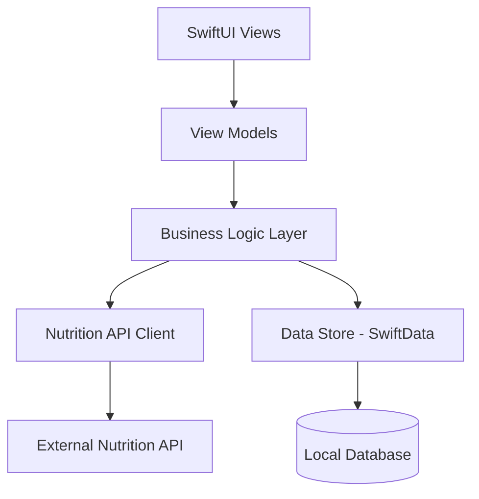

# Design Document: Calorie Tracking

## Overview

The Calorie Tracking feature provides a comprehensive iOS application for monitoring daily caloric intake. The system integrates with external nutrition APIs to provide accurate food data while maintaining local persistence for offline access and historical tracking. The architecture follows SwiftUI best practices with clear separation between data models, business logic, and UI components.

The application will use the FatSecret Platform API to fetch nutritional information, SwiftData for local persistence, and SwiftUI for the user interface. The design emphasizes data integrity, responsive UI updates, and reliable synchronization between API data and local storage.

## Architecture

### High-Level Architecture



### Layer Responsibilities

**Presentation Layer (SwiftUI Views)**
- Display daily calorie totals and progress toward goals
- Render food item lists with timestamps
- Provide search interface for nutrition API
- Handle user interactions for adding, editing, and deleting items

**View Model Layer**
- Manage UI state and user interactions
- Format data for display
- Coordinate between business logic and views
- Handle loading states and error presentation

**Business Logic Layer**
- Calculate daily calorie totals
- Validate food item data
- Manage daily log lifecycle (date transitions)
- Coordinate data persistence and API calls

**Data Access Layer**
- Nutrition API client for external data retrieval
- SwiftData models and persistence
- Data transformation between API responses and local models

## Components and Interfaces

### Core Data Models

**FoodItem**
```swift
@Model
class FoodItem {
    var id: UUID
    var name: String
    var calories: Double
    var timestamp: Date
    var servingSize: String?
    var servingUnit: String?
    var source: FoodItemSource // .api or .manual
    
    init(id: UUID = UUID(), 
         name: String, 
         calories: Double, 
         timestamp: Date = Date(),
         servingSize: String? = nil,
         servingUnit: String? = nil,
         source: FoodItemSource = .manual)
}

enum FoodItemSource {
    case api
    case manual
}
```

**DailyLog**
```swift
@Model
class DailyLog {
    var id: UUID
    var date: Date // Normalized to start of day
    var foodItems: [FoodItem]
    var dailyGoal: Double?
    
    var totalCalories: Double {
        foodItems.reduce(0) { $0 + $1.calories }
    }
    
    var remainingCalories: Double? {
        guard let goal = dailyGoal else { return nil }
        return goal - totalCalories
    }
    
    init(id: UUID = UUID(), 
         date: Date, 
         foodItems: [FoodItem] = [], 
         dailyGoal: Double? = nil)
}
```

**NutritionSearchResult**
```swift
struct NutritionSearchResult: Identifiable {
    let id: String
    let name: String
    let calories: Double
    let servingSize: String?
    let servingUnit: String?
    let brandName: String?
}
```

### Business Logic Components

**CalorieTracker**
```swift
@Observable
class CalorieTracker {
    private let dataStore: DataStore
    private let apiClient: NutritionAPIClient
    
    var currentLog: DailyLog?
    var selectedDate: Date
    
    func addFoodItem(_ item: FoodItem) async throws
    func removeFoodItem(_ item: FoodItem) async throws
    func updateFoodItem(_ item: FoodItem) async throws
    func searchFood(query: String) async throws -> [NutritionSearchResult]
    func setDailyGoal(_ calories: Double) async throws
    func loadLog(for date: Date) async throws
    func getCurrentDailyTotal() -> Double
}
```

**DataStore**
```swift
actor DataStore {
    private let modelContext: ModelContext
    
    func fetchDailyLog(for date: Date) async throws -> DailyLog?
    func saveDailyLog(_ log: DailyLog) async throws
    func fetchHistoricalLogs(from: Date, to: Date) async throws -> [DailyLog]
    func deleteFoodItem(_ item: FoodItem, from log: DailyLog) async throws
    func updateFoodItem(_ item: FoodItem, in log: DailyLog) async throws
}
```

**NutritionAPIClient**
```swift
actor NutritionAPIClient {
    private let session: URLSession
    private let apiKey: String
    
    func searchFood(query: String) async throws -> [NutritionSearchResult]
    func getFoodDetails(id: String) async throws -> NutritionSearchResult
}

enum NutritionAPIError: Error {
    case invalidResponse
    case networkError(Error)
    case invalidData
    case rateLimitExceeded
}
```

### View Components

**MainCalorieView** (Implemented)
- Displays current daily total and goal prominently
- Shows circular progress indicator with color-coded feedback
- Lists today's food items using FoodItemRow components
- Provides add button (+) in toolbar for new items
- Handles empty state with helpful messaging
- Integrates with FoodSearchView via sheet presentation

**FoodSearchView** (Implemented)
- Search bar with automatic debouncing (500ms delay)
- Real-time search triggering on query change
- Loading indicator during API requests
- Results list displaying SearchResultRow components
- Manual entry button in toolbar
- Empty results state with fallback to manual entry
- Error view with retry functionality
- Automatic dismissal after successful item selection

**SearchResultRow** (Implemented)
- Displays food name, calories, and brand name
- Shows serving size and unit information
- Visual icon indicating API source
- Tap gesture support for item selection
- Consistent styling with FoodItemRow

**FoodItemRow** (Implemented)
- Displays food name, calories, and timestamp
- Shows serving size and unit if available
- Swipe-to-delete action
- Tap gesture for editing
- Relative timestamp formatting (e.g., "2 hours ago")
- Visual icon indicating source (API vs manual)

**HistoricalView** (Not yet implemented)
- Date picker for navigation
- Daily summary for selected date
- Food item list for that day

**ManualEntryView** (Implemented)
- Form-based layout with required and optional sections
- Text field for food name with autocorrection disabled
- Number field for calories with decimal pad keyboard
- Optional serving size field (numeric input)
- Optional serving unit field (text input)
- Comprehensive input validation before saving
- Inline validation error display with warning icon
- Keyboard toolbar with "Done" button
- Focus state management for smooth navigation
- Loading state during save operation
- Save and cancel buttons in navigation bar
- Automatic dismissal after successful save

## Data Models

### Persistence Strategy

The application uses SwiftData for local persistence with the following schema:

**SwiftData Models:**
- `FoodItem`: Individual food entries with nutritional data
- `DailyLog`: Container for a day's worth of food items

**Data Relationships:**
- One-to-many: DailyLog → FoodItems
- Each DailyLog is uniquely identified by its date (normalized to midnight)

**Storage Considerations:**
- Automatic persistence on data changes
- Background context for async operations
- Cascade delete: removing a DailyLog removes associated FoodItems
- Retention policy: maintain 90 days of historical data

### API Integration

**FatSecret Platform API**:

The FatSecret API uses OAuth 1.0 authentication and provides comprehensive food and nutrition data.

**Authentication:**
- OAuth 1.0 signature-based authentication
- Requires Consumer Key and Consumer Secret
- Each request must be signed with timestamp and nonce

**Endpoints:**
- `foods.search`: Search for foods by name
- `food.get.v2`: Get detailed nutrition information for a specific food

**Request Parameters (foods.search):**
- `search_expression`: The food name to search for
- `page_number`: Page number for pagination (optional)
- `max_results`: Maximum results per page (optional, default 50)

**Response Mapping:**
```swift
struct FatSecretSearchResponse: Codable {
    let foods: FatSecretFoods
}

struct FatSecretFoods: Codable {
    let food: [FatSecretFood]
}

struct FatSecretFood: Codable {
    let foodId: String
    let foodName: String
    let foodType: String
    let brandName: String?
    let foodDescription: String
}

struct FatSecretFoodDetail: Codable {
    let foodId: String
    let foodName: String
    let servings: FatSecretServings
}

struct FatSecretServings: Codable {
    let serving: [FatSecretServing]
}

struct FatSecretServing: Codable {
    let servingId: String
    let servingDescription: String
    let calories: String
    let carbohydrate: String?
    let protein: String?
    let fat: String?
}
```

**Mapping to Domain Model:**
- Parse `foodDescription` to extract calorie information (format: "Per 100g - Calories: 250kcal")
- Transform `foodName` to FoodItem name
- Extract serving description and parse for serving size
- Handle multiple serving options by using the first or most common serving
- Convert string calorie values to Double
- Handle missing or invalid data gracefully


## Correctness Properties

*A property is a characteristic or behavior that should hold true across all valid executions of a system—essentially, a formal statement about what the system should do. Properties serve as the bridge between human-readable specifications and machine-verifiable correctness guarantees.*

### Property 1: Food Item Addition Completeness

*For any* valid food item, when added to a daily log, the log should contain that item with a timestamp within 1 second of the current time.

**Validates: Requirements 1.1, 1.2**

### Property 2: Daily Total Calculation Invariant

*For any* daily log, the displayed total calories should always equal the sum of calories from all food items in that log, regardless of additions, deletions, or modifications.

**Validates: Requirements 1.3, 3.1, 3.3, 5.1, 5.2**

### Property 3: Data Persistence Round-Trip

*For any* daily log with food items and goal settings, persisting the data then loading it should produce an equivalent daily log with the same items, totals, and goal.

**Validates: Requirements 1.4, 4.1, 5.3, 7.2**

### Property 4: Search Results Relevance

*For any* search query string, all returned nutrition search results should contain the query string (case-insensitive) in either the food name or brand name.

**Validates: Requirements 2.1**

### Property 5: Search Result Completeness

*For any* nutrition search result, the rendered display should include both the food name and calorie information.

**Validates: Requirements 2.2**

### Property 6: API Selection Preserves Data

*For any* nutrition search result selected from the API, when added to the daily log, the resulting food item should have the same name, calories, and serving information as the original search result.

**Validates: Requirements 2.4**

### Property 7: Remaining Calories Calculation

*For any* daily log with a goal set, the remaining calories should equal the goal minus the total calories, and this value should be negative when the goal is exceeded.

**Validates: Requirements 4.4**

### Property 8: Goal Exceeded State

*For any* daily log where the total calories exceed the daily goal, the UI state should indicate that the goal has been exceeded.

**Validates: Requirements 4.3**

### Property 9: Historical Display Completeness

*For any* historical daily log, the displayed information should include the date, total calories, and all food items from that log.

**Validates: Requirements 6.3**

### Property 10: Date-Based Log Retrieval

*For any* date with an existing daily log, loading that date should return the specific log for that date and no other.

**Validates: Requirements 6.1**

### Property 11: Food Item Deletion Completeness

*For any* food item in a daily log, after deletion, the item should not appear in the log and the total should be reduced by that item's calories.

**Validates: Requirements 5.1**

### Property 12: Food Item Edit Propagation

*For any* food item in a daily log, when its calorie value is changed, the daily total should reflect the new value, not the old value.

**Validates: Requirements 5.2**

### Property 13: Calorie Value Validation

*For any* data received from the nutrition API or entered manually, calorie values must be non-negative numbers, and any negative or non-numeric values should be rejected.

**Validates: Requirements 8.1, 8.3**

### Property 14: Required Fields Validation

*For any* food item being stored, all required fields (name, calories, timestamp) must be present and valid, and items with missing required fields should be rejected.

**Validates: Requirements 8.3**

### Property 15: Main Screen Display Completeness

*For any* current daily log, the main screen should display both the current daily total and the daily goal (if set).

**Validates: Requirements 4.2**

## Error Handling

### API Error Scenarios

**Network Failures:**
- Timeout after 30 seconds
- Display user-friendly error message
- Provide option to retry or enter manually
- Cache last successful search results for offline reference

**Invalid API Responses:**
- Validate response structure before parsing
- Log malformed responses for debugging
- Fall back to manual entry mode
- Display specific error message indicating API issue

**Rate Limiting:**
- Detect 429 status codes
- Implement exponential backoff
- Display message about temporary unavailability
- Queue requests for retry

### Data Validation Errors

**Invalid Calorie Values:**
- Reject negative numbers
- Reject non-numeric input
- Display validation error to user
- Highlight invalid field in UI

**Missing Required Fields:**
- Validate before saving
- Display specific error for each missing field
- Prevent save until all required fields present

### Persistence Errors

**Storage Failures:**
- Catch SwiftData errors
- Display error message to user
- Attempt retry with exponential backoff
- Log error for debugging

**Data Corruption:**
- Validate data integrity on load
- Attempt recovery from backup if available
- Clear corrupted data as last resort
- Notify user of data loss

## Testing Strategy

### Dual Testing Approach

The testing strategy employs both unit tests and property-based tests to ensure comprehensive coverage:

**Unit Tests** focus on:
- Specific examples demonstrating correct behavior
- Edge cases (empty logs, zero calories, boundary dates)
- Error conditions (API failures, invalid data, storage errors)
- Integration points between components
- Date transition scenarios
- Crash recovery scenarios

**Property-Based Tests** focus on:
- Universal properties that hold for all inputs
- Comprehensive input coverage through randomization
- Invariants that must always hold
- Round-trip properties for persistence and serialization
- Calculation correctness across random data sets

### Property-Based Testing Configuration

**Framework:** Use Swift Testing with custom property-based testing utilities or a library like SwiftCheck

**Test Configuration:**
- Minimum 100 iterations per property test
- Each test tagged with format: **Feature: calorie-tracking, Property {N}: {property description}**
- Random seed logging for reproducibility
- Shrinking enabled to find minimal failing cases

**Example Test Structure:**
```swift
@Test("Feature: calorie-tracking, Property 2: Daily Total Calculation Invariant")
func testDailyTotalInvariant() async throws {
    // Run 100 iterations with random food items
    for _ in 0..<100 {
        let randomItems = generateRandomFoodItems(count: Int.random(in: 0...20))
        let log = DailyLog(date: Date(), foodItems: randomItems)
        
        let expectedTotal = randomItems.reduce(0) { $0 + $1.calories }
        #expect(log.totalCalories == expectedTotal)
    }
}
```

### Test Coverage Goals

- 90%+ code coverage for business logic
- 100% coverage of error handling paths
- All 15 correctness properties implemented as property tests
- Edge cases covered by unit tests
- Integration tests for API client and data store

### Testing Priorities

1. **Critical Path:** Food item addition, total calculation, persistence
2. **Data Integrity:** Validation, error handling, recovery
3. **API Integration:** Search, selection, error scenarios
4. **UI State:** Display correctness, goal tracking, historical views
5. **Performance:** Response times, large data sets, memory usage
