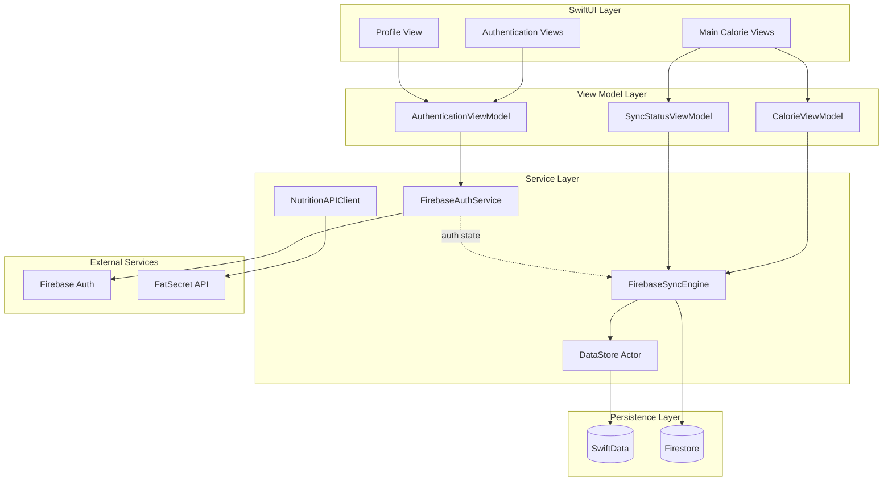

# Design Document: Firebase User Authentication and Cloud Sync

## Overview

This design adds Firebase Authentication and Firestore cloud storage to the CountMe iOS application while preserving the existing offline-first architecture. The system introduces a dual-persistence model where data is stored both locally (SwiftData) and in the cloud (Firestore), with automatic synchronization when online.

The design maintains backward compatibility with existing features, preserves the FatSecret API integration, and ensures the app remains fully functional offline. User data is secured through Firebase Authentication and Firestore security rules that restrict access to authenticated users' own data.

### Key Design Principles

1. **Offline-First**: All operations work locally first, sync to cloud when available
2. **Dual Persistence**: SwiftData for local, Firestore for cloud - both always in sync
3. **Last-Write-Wins**: Conflict resolution based on modification timestamps
4. **Security by Default**: Firestore rules enforce user-scoped data access
5. **Graceful Degradation**: Network failures don't block user operations
6. **Minimal Migration**: Existing local data seamlessly migrates to cloud on first sign-in

## Architecture

### High-Level Architecture



### Data Flow

**Write Operation (Online)**:
```
User Action → ViewModel → SyncEngine → [DataStore + Firestore] → UI Update
```

**Write Operation (Offline)**:
```
User Action → ViewModel → SyncEngine → DataStore → Queue for Sync → UI Update
```

**Read Operation**:
```
User Action → ViewModel → DataStore → SwiftData → UI Display
```

**Sync Operation (Coming Online)**:
```
Network Available → SyncEngine → Upload Queued Changes → Download Cloud Changes → Merge → DataStore
```

## Components and Interfaces

### 1. FirebaseAuthService

Actor responsible for all Firebase Authentication operations.

```swift
@MainActor
class FirebaseAuthService: ObservableObject {
    @Published var currentUser: User?
    @Published var authState: AuthenticationState = .loading
    @Published var errorMessage: String?
    
    private var authStateListener: AuthStateDidChangeListenerHandle?
    
    enum AuthenticationState {
        case authenticated(User)
        case unauthenticated
        case loading
    }
    
    // MARK: - Initialization
    
    init() {
        setupAuthListener()
    }
    
    // MARK: - Authentication Operations
    
    /// Creates a new user account with email and password
    /// - Parameters:
    ///   - email: User's email address (must be valid format)
    ///   - password: User's password (minimum 8 characters)
    /// - Returns: Firebase User object
    /// - Throws: AuthError for validation or Firebase errors
    func createAccount(email: String, password: String) async throws -> User
    
    /// Signs in an existing user with email and password
    /// - Parameters:
    ///   - email: User's email address
    ///   - password: User's password
    /// - Returns: Firebase User object
    /// - Throws: AuthError for invalid credentials or Firebase errors
    func signIn(email: String, password: String) async throws -> User
    
    /// Signs out the current user
    /// - Throws: AuthError if sign out fails
    func signOut() throws
    
    /// Sends a password reset email to the specified address
    /// - Parameter email: User's email address
    /// - Throws: AuthError if email sending fails
    func sendPasswordReset(email: String) async throws
    
    /// Deletes the current user's account and all associated data
    /// - Throws: AuthError if deletion fails
    func deleteAccount() async throws
    
    // MARK: - Private Methods
    
    private func setupAuthListener()
    private func validateEmail(_ email: String) throws
    private func validatePassword(_ password: String) throws
}
```

### 2. FirebaseSyncEngine

Actor responsible for synchronizing data between SwiftData and Firestore.

```swift
actor FirebaseSyncEngine {
    private let dataStore: DataStore
    private let db: Firestore
    private var listeners: [ListenerRegistration] = []
    private var syncQueue: [SyncOperation] = []
    private var isSyncing = false
    
    enum SyncOperation {
        case create(entity: SyncableEntity, timestamp: Date)
        case update(entity: SyncableEntity, timestamp: Date)
        case delete(entityId: String, entityType: EntityType, timestamp: Date)
    }
    
    enum EntityType {
        case foodItem
        case dailyLog
        case customMeal
        case userGoal
    }
    
    // MARK: - Initialization
    
    init(dataStore: DataStore) {
        self.dataStore = dataStore
        self.db = Firestore.firestore()
        configureOfflinePersistence()
    }
    
    // MARK: - Sync Operations
    
    /// Starts real-time listeners for user's cloud data
    /// - Parameter userId: Authenticated user's unique identifier
    func startListening(userId: String) async
    
    /// Stops all real-time listeners
    func stopListening()
    
    /// Syncs a food item to both local and cloud storage
    /// - Parameters:
    ///   - foodItem: The food item to sync
    ///   - userId: Owner's user ID
    /// - Throws: SyncError if operation fails
    func syncFoodItem(_ foodItem: FoodItem, userId: String) async throws
    
    /// Syncs a daily log to both local and cloud storage
    /// - Parameters:
    ///   - dailyLog: The daily log to sync
    ///   - userId: Owner's user ID
    /// - Throws: SyncError if operation fails
    func syncDailyLog(_ dailyLog: DailyLog, userId: String) async throws
    
    /// Syncs a custom meal to both local and cloud storage
    /// - Parameters:
    ///   - customMeal: The custom meal to sync
    ///   - userId: Owner's user ID
    /// - Throws: SyncError if operation fails
    func syncCustomMeal(_ customMeal: CustomMeal, userId: String) async throws
    
    /// Syncs user goal to both local and cloud storage
    /// - Parameters:
    ///   - goal: The calorie goal
    ///   - userId: Owner's user ID
    /// - Throws: SyncError if operation fails
    func syncUserGoal(_ goal: Int, userId: String) async throws
    
    /// Deletes an entity from both local and cloud storage
    /// - Parameters:
    ///   - entityId: Unique identifier of entity to delete
    ///   - entityType: Type of entity being deleted
    ///   - userId: Owner's user ID
    /// - Throws: SyncError if operation fails
    func deleteEntity(entityId: String, entityType: EntityType, userId: String) async throws
    
    /// Performs initial migration of local data to cloud
    /// - Parameter userId: User ID to associate with migrated data
    /// - Returns: Migration result with success/failure counts
    func migrateLocalData(userId: String) async throws -> MigrationResult
    
    /// Manually triggers sync of queued operations
    /// - Throws: SyncError if sync fails
    func forceSyncNow() async throws
    
    // MARK: - Private Methods
    
    private func configureOfflinePersistence()
    private func queueOperation(_ operation: SyncOperation)
    private func processQueue() async throws
    private func resolveConflict(local: SyncableEntity, cloud: SyncableEntity) -> SyncableEntity
    private func uploadToFirestore(_ entity: SyncableEntity, userId: String) async throws
    private func downloadFromFirestore(userId: String) async throws
    private func setupRealtimeListener(collection: String, userId: String)
    private func handleCloudUpdate(_ snapshot: DocumentSnapshot, entityType: EntityType)
    private func applyRetentionPolicy(userId: String) async throws
}
```

### 3. SyncableEntity Protocol

Protocol that all synchronized entities must conform to.

```swift
protocol SyncableEntity {
    var id: String { get }
    var userId: String { get set }
    var lastModified: Date { get set }
    var syncStatus: SyncStatus { get set }
    
    func toFirestoreData() -> [String: Any]
    static func fromFirestoreData(_ data: [String: Any]) throws -> Self
}

enum SyncStatus: String, Codable {
    case synced          // Successfully synced to cloud
    case pendingUpload   // Waiting to upload to cloud
    case pendingDelete   // Waiting to delete from cloud
    case conflict        // Conflict detected, needs resolution
}
```

### 4. Updated Data Models

All existing models need to conform to SyncableEntity:

```swift
@Model
final class FoodItem: SyncableEntity {
    // Existing properties
    var id: String
    var name: String
    var calories: Double
    var servingSize: String
    var timestamp: Date
    var source: FoodItemSource
    
    // New properties for sync
    var userId: String = ""
    var lastModified: Date = Date()
    var syncStatus: SyncStatus = .pendingUpload
    
    // Firestore conversion methods
    func toFirestoreData() -> [String: Any] {
        return [
            "id": id,
            "name": name,
            "calories": calories,
            "servingSize": servingSize,
            "timestamp": Timestamp(date: timestamp),
            "source": source.rawValue,
            "userId": userId,
            "lastModified": Timestamp(date: lastModified),
            "syncStatus": syncStatus.rawValue
        ]
    }
    
    static func fromFirestoreData(_ data: [String: Any]) throws -> FoodItem {
        guard let id = data["id"] as? String,
              let name = data["name"] as? String,
              let calories = data["calories"] as? Double,
              let servingSize = data["servingSize"] as? String,
              let timestamp = (data["timestamp"] as? Timestamp)?.dateValue(),
              let sourceRaw = data["source"] as? String,
              let source = FoodItemSource(rawValue: sourceRaw),
              let userId = data["userId"] as? String,
              let lastModified = (data["lastModified"] as? Timestamp)?.dateValue(),
              let syncStatusRaw = data["syncStatus"] as? String,
              let syncStatus = SyncStatus(rawValue: syncStatusRaw)
        else {
            throw SyncError.invalidFirestoreData
        }
        
        let item = FoodItem(
            name: name,
            calories: calories,
            servingSize: servingSize,
            source: source
        )
        item.id = id
        item.timestamp = timestamp
        item.userId = userId
        item.lastModified = lastModified
        item.syncStatus = syncStatus
        return item
    }
}

// Similar updates for DailyLog, CustomMeal, and user goal storage
```

### 5. Authentication Views

New SwiftUI views for authentication flow:

```swift
struct AuthenticationView: View {
    @StateObject private var authService = FirebaseAuthService()
    @State private var showSignUp = false
    
    var body: some View {
        Group {
            switch authService.authState {
            case .loading:
                ProgressView("Loading...")
            case .authenticated:
                MainCalorieView()
            case .unauthenticated:
                if showSignUp {
                    SignUpView(authService: authService, showSignUp: $showSignUp)
                } else {
                    SignInView(authService: authService, showSignUp: $showSignUp)
                }
            }
        }
    }
}

struct SignInView: View {
    @ObservedObject var authService: FirebaseAuthService
    @Binding var showSignUp: Bool
    @State private var email = ""
    @State private var password = ""
    @State private var showError = false
    
    var body: some View {
        // Sign in form with email, password, forgot password link
    }
}

struct SignUpView: View {
    @ObservedObject var authService: FirebaseAuthService
    @Binding var showSignUp: Bool
    @State private var email = ""
    @State private var password = ""
    @State private var confirmPassword = ""
    @State private var showError = false
    
    var body: some View {
        // Sign up form with email, password, confirm password
    }
}

struct ProfileView: View {
    @ObservedObject var authService: FirebaseAuthService
    @State private var showDeleteConfirmation = false
    
    var body: some View {
        // User profile with email, sign out, delete account
    }
}
```

### 6. Sync Status UI

Visual feedback for sync operations:

```swift
@MainActor
class SyncStatusViewModel: ObservableObject {
    @Published var syncState: SyncState = .synced
    @Published var isOffline = false
    @Published var lastSyncTime: Date?
    
    enum SyncState {
        case synced
        case syncing
        case error(String)
        case offline
    }
    
    func observeSyncEngine(_ engine: FirebaseSyncEngine) {
        // Monitor sync engine state and update UI
    }
}

struct SyncStatusBadge: View {
    @ObservedObject var viewModel: SyncStatusViewModel
    
    var body: some View {
        HStack {
            Image(systemName: iconName)
            Text(statusText)
        }
        .font(.caption)
        .foregroundColor(statusColor)
    }
    
    private var iconName: String {
        switch viewModel.syncState {
        case .synced: return "checkmark.icloud"
        case .syncing: return "arrow.clockwise.icloud"
        case .error: return "exclamationmark.icloud"
        case .offline: return "icloud.slash"
        }
    }
    
    // Additional computed properties for UI
}
```

## Data Models

### Firestore Collection Structure

```
users/{userId}/
├── profile/
│   └── settings
│       ├── dailyCalorieGoal: Int
│       ├── createdAt: Timestamp
│       └── lastModified: Timestamp
│
├── dailyLogs/
│   └── {logId}
│       ├── id: String
│       ├── date: Timestamp (normalized to midnight)
│       ├── totalCalories: Double
│       ├── userId: String
│       ├── lastModified: Timestamp
│       └── syncStatus: String
│
├── foodItems/
│   └── {itemId}
│       ├── id: String
│       ├── name: String
│       ├── calories: Double
│       ├── servingSize: String
│       ├── timestamp: Timestamp
│       ├── source: String (api/manual)
│       ├── dailyLogId: String (reference)
│       ├── userId: String
│       ├── lastModified: Timestamp
│       └── syncStatus: String
│
└── customMeals/
    └── {mealId}
        ├── id: String
        ├── name: String
        ├── totalCalories: Double
        ├── ingredients: Array<Map>
        │   ├── name: String
        │   ├── calories: Double
        │   └── servingSize: String
        ├── userId: String
        ├── lastModified: Timestamp
        └── syncStatus: String
```

### Firestore Security Rules

```javascript
rules_version = '2';
service cloud.firestore {
  match /databases/{database}/documents {
    // Helper function to check authentication
    function isAuthenticated() {
      return request.auth != null;
    }
    
    // Helper function to check user owns the data
    function isOwner(userId) {
      return isAuthenticated() && request.auth.uid == userId;
    }
    
    // User profile and settings
    match /users/{userId}/profile/{document=**} {
      allow read, write: if isOwner(userId);
    }
    
    // Daily logs - user can only access their own
    match /users/{userId}/dailyLogs/{logId} {
      allow read, write: if isOwner(userId);
      allow create: if isAuthenticated() && request.resource.data.userId == request.auth.uid;
    }
    
    // Food items - user can only access their own
    match /users/{userId}/foodItems/{itemId} {
      allow read, write: if isOwner(userId);
      allow create: if isAuthenticated() && request.resource.data.userId == request.auth.uid;
    }
    
    // Custom meals - user can only access their own
    match /users/{userId}/customMeals/{mealId} {
      allow read, write: if isOwner(userId);
      allow create: if isAuthenticated() && request.resource.data.userId == request.auth.uid;
    }
  }
}
```

### Conflict Resolution Strategy

**Last-Write-Wins with Special Cases**:

1. **Standard Entities (FoodItem, CustomMeal, UserGoal)**:
   - Compare `lastModified` timestamps
   - Keep the version with the most recent timestamp
   - Update both local and cloud with winning version

2. **Daily Logs (Special Case)**:
   - If both versions have different food items, merge them
   - Combine food item lists from both versions
   - Remove duplicates based on food item ID
   - Recalculate total calories
   - Set `lastModified` to current time

3. **Deletions**:
   - Deletions always win over modifications
   - If one version is deleted, delete from both stores
   - Track deletion timestamp to handle late-arriving updates

```swift
private func resolveConflict(local: SyncableEntity, cloud: SyncableEntity) -> SyncableEntity {
    // Special handling for daily logs
    if let localLog = local as? DailyLog, let cloudLog = cloud as? DailyLog {
        return mergeDailyLogs(local: localLog, cloud: cloudLog)
    }
    
    // Standard last-write-wins for other entities
    return local.lastModified > cloud.lastModified ? local : cloud
}

private func mergeDailyLogs(local: DailyLog, cloud: DailyLog) -> DailyLog {
    // Combine food items from both versions
    var mergedItems = local.foodItems
    for cloudItem in cloud.foodItems {
        if !mergedItems.contains(where: { $0.id == cloudItem.id }) {
            mergedItems.append(cloudItem)
        }
    }
    
    // Create merged log
    let merged = DailyLog(date: local.date)
    merged.foodItems = mergedItems
    merged.lastModified = Date()
    merged.syncStatus = .synced
    return merged
}
```

## Error Handling

### Error Types

```swift
enum AuthError: LocalizedError {
    case invalidEmail
    case weakPassword
    case emailAlreadyInUse
    case invalidCredentials
    case networkError
    case userNotFound
    case accountDeletionFailed
    
    var errorDescription: String? {
        switch self {
        case .invalidEmail:
            return "Please enter a valid email address"
        case .weakPassword:
            return "Password must be at least 8 characters"
        case .emailAlreadyInUse:
            return "This email is already registered"
        case .invalidCredentials:
            return "Invalid email or password"
        case .networkError:
            return "Network error. Please check your connection"
        case .userNotFound:
            return "No account found with this email"
        case .accountDeletionFailed:
            return "Failed to delete account. Please try again"
        }
    }
}

enum SyncError: LocalizedError {
    case notAuthenticated
    case networkUnavailable
    case firestoreError(Error)
    case dataStoreError(Error)
    case invalidFirestoreData
    case conflictResolutionFailed
    case migrationFailed(reason: String)
    
    var errorDescription: String? {
        switch self {
        case .notAuthenticated:
            return "You must be signed in to sync data"
        case .networkUnavailable:
            return "Network unavailable. Changes will sync when online"
        case .firestoreError(let error):
            return "Cloud sync error: \(error.localizedDescription)"
        case .dataStoreError(let error):
            return "Local storage error: \(error.localizedDescription)"
        case .invalidFirestoreData:
            return "Invalid data format from cloud"
        case .conflictResolutionFailed:
            return "Failed to resolve data conflict"
        case .migrationFailed(let reason):
            return "Migration failed: \(reason)"
        }
    }
}
```

### Error Handling Patterns

**Authentication Errors**:
- Display user-friendly error messages in UI
- Log detailed errors for debugging
- Provide retry option for network errors
- Clear sensitive data on authentication failure

**Sync Errors**:
- Queue operations for retry with exponential backoff
- Display sync status in UI (synced, syncing, error, offline)
- Allow manual retry via pull-to-refresh or button
- Preserve local data even if sync fails
- Log sync errors with context for debugging

**Network Errors**:
- Detect network availability changes
- Automatically retry when network becomes available
- Show offline indicator in UI
- Queue all operations for later sync
- Timeout after 30 seconds for sync operations

**Data Validation Errors**:
- Validate data before attempting sync
- Reject invalid data with specific error messages
- Don't queue invalid data for sync
- Log validation failures for debugging

## Testing Strategy

### Unit Testing

Unit tests will verify specific examples, edge cases, and error conditions:

**Authentication Tests**:
- Valid email/password combinations
- Invalid email formats
- Weak passwords (< 8 characters)
- Existing email registration attempts
- Sign out clears credentials
- Password reset email sending

**Sync Engine Tests**:
- Single entity sync (create, update, delete)
- Queue management (add, process, clear)
- Offline operation queuing
- Network availability detection
- Retry logic with exponential backoff

**Conflict Resolution Tests**:
- Last-write-wins for standard entities
- Daily log merging with different food items
- Deletion wins over modification
- Timestamp comparison accuracy

**Data Conversion Tests**:
- FoodItem to/from Firestore data
- DailyLog to/from Firestore data
- CustomMeal to/from Firestore data
- Invalid Firestore data handling

**Error Handling Tests**:
- Authentication error mapping
- Sync error handling
- Network error recovery
- Data validation errors

### Property-Based Testing

Property tests will verify universal properties across all inputs with 100+ iterations per test. Each test will be tagged with: **Feature: firebase-user-auth, Property {N}: {property_text}**

The property-based testing library for Swift will be **swift-check** (https://github.com/typelift/SwiftCheck), which provides QuickCheck-style property testing for Swift.

Configuration:
```swift
import SwiftCheck

// Each property test runs 100 iterations minimum
let config = CheckerArguments(
    replay: nil,
    maxAllowableSuccessfulTests: 100,
    maxTestCaseSize: 100
)
```


## Correctness Properties

A property is a characteristic or behavior that should hold true across all valid executions of a system - essentially, a formal statement about what the system should do. Properties serve as the bridge between human-readable specifications and machine-verifiable correctness guarantees.

### Authentication and Session Management

**Property 1: Valid Account Creation**
*For any* valid email address and password (≥8 characters), creating an account should succeed and return a user object with a unique identifier.
**Validates: Requirements 1.1**

**Property 2: Invalid Email Rejection**
*For any* string that is not a valid email format, attempting to create an account should fail with an invalid email error.
**Validates: Requirements 1.2**

**Property 3: Short Password Rejection**
*For any* password string with length < 8 characters, attempting to create an account should fail with a weak password error.
**Validates: Requirements 1.3**

**Property 4: Auto Sign-In After Creation**
*For any* successful account creation, the system should automatically establish an authenticated session without requiring a separate sign-in call.
**Validates: Requirements 1.4**

**Property 5: Valid Sign-In**
*For any* existing account with valid credentials, signing in should succeed and establish an authenticated session with the correct user identifier.
**Validates: Requirements 2.1**

**Property 6: Invalid Credentials Rejection**
*For any* non-existent account or incorrect password, attempting to sign in should fail with an invalid credentials error.
**Validates: Requirements 2.2**

**Property 7: Session Persistence**
*For any* authenticated session, simulating an app restart should preserve the session and maintain the authenticated state.
**Validates: Requirements 2.3**

**Property 8: User ID Availability**
*For any* active authenticated session, the user's unique identifier should be accessible to all system components that require it.
**Validates: Requirements 2.5**

### Sign Out Behavior

**Property 9: Sign Out Terminates Session**
*For any* authenticated user, signing out should terminate the session and transition the authentication state to unauthenticated.
**Validates: Requirements 3.1**

**Property 10: Sign Out Clears Credentials**
*For any* authenticated user, signing out should clear all cached authentication credentials from memory and persistent storage.
**Validates: Requirements 3.2**

**Property 11: Sign Out Retains Local Data**
*For any* authenticated user with local data, signing out should preserve all local data in SwiftData for potential future sign-in.
**Validates: Requirements 3.3**

### Dual Persistence

**Property 12: CRUD Operations Dual Persistence**
*For any* entity type (FoodItem, CustomMeal, DailyLog, UserGoal) and any CRUD operation (create, update, delete), the operation should persist to both Local_Store and Cloud_Store when online, maintaining identical state in both.
**Validates: Requirements 5.1, 5.2, 5.3, 5.4, 5.5**

### Synchronization

**Property 13: Initial Sync Downloads All Data**
*For any* user signing in on a new device (empty local store), the sync engine should download all of the user's cloud data to the local store.
**Validates: Requirements 6.1**

**Property 14: Data Consistency After Sync**
*For any* completed synchronization operation, the local store and cloud store should contain identical data for the authenticated user.
**Validates: Requirements 6.2, 6.5**

**Property 15: Offline Operations Work Locally**
*For any* calorie tracking operation (add food, create meal, set goal, delete item) performed while offline, the operation should succeed using only the local store.
**Validates: Requirements 7.1**

**Property 16: Bidirectional Sync On Reconnect**
*For any* queued local changes and any cloud changes made on other devices, when connectivity is restored, all local changes should upload to cloud and all cloud changes should download to local.
**Validates: Requirements 7.3, 7.4**

### Offline and Queuing

**Property 17: Offline Changes Queued**
*For any* data modification made while offline or during intermittent connectivity, the sync engine should queue the operation for later synchronization.
**Validates: Requirements 7.2, 13.4**

**Property 18: Sync Failure Preserves Local Data**
*For any* synchronization failure (network error, timeout, server error), all local changes should be preserved in the local store and remain queued for retry.
**Validates: Requirements 13.3**

### Conflict Resolution

**Property 19: Last-Write-Wins for Standard Entities**
*For any* data conflict involving FoodItem, CustomMeal, or UserGoal, the version with the most recent lastModified timestamp should win and be applied to both stores.
**Validates: Requirements 8.1**

**Property 20: Deletion Wins in Conflicts**
*For any* data conflict where one version is deleted and the other is modified, the deletion should win and the entity should be removed from both stores.
**Validates: Requirements 8.2**

**Property 21: Daily Log Merging**
*For any* data conflict involving DailyLog entities, the food items from both versions should be merged (union of food items, removing duplicates by ID), and the merged result should be applied to both stores.
**Validates: Requirements 8.4**

### Migration

**Property 22: Migration Success**
*For any* user creating an account with existing local data, the migration process should upload all local data to cloud and mark all entities as synced.
**Validates: Requirements 9.1, 9.3**

**Property 23: Migration Retry and Data Preservation**
*For any* migration failure, the migration process should automatically retry with exponential backoff and preserve all local data until migration succeeds.
**Validates: Requirements 9.4**

### Security

**Property 24: Data Has User ID**
*For any* entity stored in cloud storage, the entity should have a userId field that matches the authenticated user's identifier.
**Validates: Requirements 10.3**

**Property 25: Query Filters By User ID**
*For any* query to cloud storage, the results should only include entities where the userId matches the authenticated user's identifier.
**Validates: Requirements 10.4**

### Retention Policies

**Property 26: 90-Day Retention With Sync**
*For any* daily log older than 90 days, the retention process should delete it from both local store and cloud store, and the deletion should synchronize across all devices.
**Validates: Requirements 11.1, 11.2, 11.5**

**Property 27: Custom Meals Retained Indefinitely**
*For any* custom meal regardless of age, the retention process should never delete it based on age alone.
**Validates: Requirements 11.3**

**Property 28: Goals Retained Indefinitely**
*For any* user goal regardless of age, the retention process should never delete it based on age alone.
**Validates: Requirements 11.4**

### Error Handling

**Property 29: Exponential Backoff Retry**
*For any* network error during synchronization, the sync engine should retry the operation with exponentially increasing delays between attempts.
**Validates: Requirements 13.1**

**Property 30: Intermittent Connectivity Handling**
*For any* sequence of network availability changes (online → offline → online), the sync engine should queue operations during offline periods and automatically sync when connectivity is restored.
**Validates: Requirements 13.4**

### Account Management

**Property 31: Account Deletion Cleanup**
*For any* authenticated user requesting account deletion, the system should delete all cloud data, sign out the user, and clear all local data.
**Validates: Requirements 14.2, 14.3, 14.4**

**Property 32: UI Updates On Auth State Change**
*For any* authentication state change (unauthenticated → authenticated, authenticated → unauthenticated, loading → authenticated), the UI should update to reflect the new state.
**Validates: Requirements 12.4**

