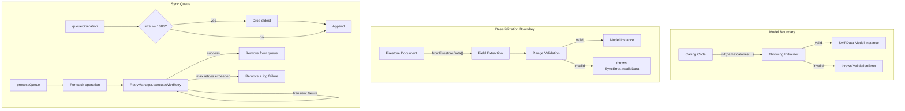

# Design Document: Robustness Hardening

## Overview

This design adds three layers of defensive validation to CountMe:

1. **Model constructor validation** — Throwing initializers on FoodItem, ExerciseItem, Ingredient, CustomMeal, and DailyLog that reject invalid inputs before data enters the system.
2. **Firestore deserialization bounds checking** — Range validation inside each model's `fromFirestoreData()` so corrupted or tampered cloud documents are rejected at the boundary.
3. **Sync queue hardening** — A size cap on the offline operation queue, and per-item retry via the existing `RetryManager` so transient failures don't block the entire queue.

All three areas share a common validation constants file so thresholds (e.g., max calories = 50,000) are defined once.

## Architecture



## Components and Interfaces

### ValidationError

A new error enum in `CountMe/Models/ValidationError.swift`:

```swift
enum ValidationError: LocalizedError, Equatable {
    case emptyName(modelType: String)
    case negativeCalories(modelType: String, value: Double)
    case caloriesExceedMax(modelType: String, value: Double, max: Double)
    case negativeMacro(modelType: String, field: String, value: Double)
    case macroExceedMax(modelType: String, field: String, value: Double, max: Double)
    case negativeDuration(value: Double)
    case durationExceedMax(value: Double, max: Double)
    case nonPositiveQuantity(value: Double)
    case emptyUnit
    case emptyIngredients
    case nonPositiveServings(value: Double)
    case negativeGoal(value: Double)
    case goalExceedMax(value: Double, max: Double)
}
```

Each case carries enough context for a descriptive `errorDescription`.

### ValidationConstants

A constants file in `CountMe/Models/ValidationConstants.swift`:

```swift
enum ValidationConstants {
    static let maxCalories: Double = 50_000
    static let maxMacroGrams: Double = 10_000
    static let maxDurationMinutes: Double = 1_440  // 24 hours
    static let maxDailyGoal: Double = 50_000
}
```

All model validators and deserialization validators reference these constants so thresholds are defined in one place.

### Model Constructor Changes

Each model's `init` becomes `throws`. The validation logic runs before assigning stored properties. For SwiftData `@Model` classes, the throwing initializer pattern is:

```swift
// FoodItem example
init(
    id: UUID = UUID(),
    name: String,
    calories: Double,
    // ... other params
) throws {
    // Validate before assignment
    guard !name.trimmingCharacters(in: .whitespacesAndNewlines).isEmpty else {
        throw ValidationError.emptyName(modelType: "FoodItem")
    }
    guard calories >= 0 else {
        throw ValidationError.negativeCalories(modelType: "FoodItem", value: calories)
    }
    guard calories <= ValidationConstants.maxCalories else {
        throw ValidationError.caloriesExceedMax(modelType: "FoodItem", value: calories, max: ValidationConstants.maxCalories)
    }
    // ... macro validation for optional fields (only when non-nil)
    
    self._id = id
    self.name = name
    self.calories = calories
    // ... assign remaining
}
```

The same pattern applies to ExerciseItem, Ingredient, CustomMeal, and DailyLog. Optional macro fields (protein, carbohydrates, fats) are only validated when non-nil.

### fromFirestoreData() Changes

After extracting fields from the Firestore dictionary (existing `guard let` block), a new validation step runs before constructing the model:

```swift
static func fromFirestoreData(_ data: [String: Any]) throws -> FoodItem {
    // Existing field extraction ...
    
    // NEW: Range validation
    guard !name.trimmingCharacters(in: .whitespacesAndNewlines).isEmpty else {
        throw SyncError.invalidData(reason: "FoodItem name is empty")
    }
    guard calories >= 0, calories <= ValidationConstants.maxCalories else {
        throw SyncError.invalidData(reason: "FoodItem calories \(calories) out of range 0...\(ValidationConstants.maxCalories)")
    }
    // ... similar checks for macros, exercise fields, etc.
    
    // Use try! since we just validated — or call a non-throwing internal init
    return FoodItem(...)
}
```

Since `fromFirestoreData` already throws `SyncError`, it continues to throw `SyncError.invalidData(reason:)` for range violations rather than `ValidationError`. This keeps the error type consistent at the sync boundary.

**Internal initializer approach**: To avoid double-validation (once in `fromFirestoreData`, once in the throwing `init`), each model will have an `internal init(validated:...)` that skips validation. The `fromFirestoreData` methods validate then call the internal init. The public throwing `init` is what all other callers use.

### Sync Queue Hardening

Changes to `FirebaseSyncEngine`:

**Size limit** — A constant `maxQueueSize = 1000`. In `queueOperation()`, after deduplication and before appending, if `syncQueue.count >= maxQueueSize`, remove the first (oldest) element.

**Per-item retry** — In `processQueue()`, wrap each operation's execution in `retryManager.executeWithRetry(operationId:operation:)`. On success, remove from queue. On `SyncError.maxRetriesExceeded`, remove from queue and log. On other non-retryable errors, remove and log. The loop continues regardless of individual failures.

```swift
func processQueue() async throws {
    guard !isSyncing, !syncQueue.isEmpty else { return }
    isSyncing = true
    defer { isSyncing = false }
    
    let snapshot = syncQueue.sorted { $0.timestamp < $1.timestamp }
    var failedCount = 0
    
    for operation in snapshot {
        let opId = "queue_\(operation.entityId)_\(operation.entityType.rawValue)"
        do {
            try await retryManager.executeWithRetry(operationId: opId) {
                switch operation {
                case .create(let id, let type, _),
                     .update(let id, let type, _):
                    try await self.processUploadOperation(entityId: id, entityType: type)
                case .delete(let id, let type, _):
                    try await self.processDeleteOperation(entityId: id, entityType: type)
                }
            }
            // Success — remove
            syncQueue.removeAll { $0.entityId == operation.entityId && $0.entityType == operation.entityType }
        } catch {
            // Failed after retries — remove from queue, log, continue
            syncQueue.removeAll { $0.entityId == operation.entityId && $0.entityType == operation.entityType }
            failedCount += 1
            logError(error as? SyncError ?? .firestoreError(error), context: "processQueue", entityId: operation.entityId)
        }
    }
    
    persistQueue()
    if failedCount > 0 {
        print("Queue processing: \(failedCount) operations failed after retries")
    }
}
```

## Data Models

### ValidationError enum

| Case | Fields | Used By |
|------|--------|---------|
| `emptyName` | `modelType: String` | FoodItem, ExerciseItem, Ingredient, CustomMeal |
| `negativeCalories` | `modelType: String, value: Double` | FoodItem, ExerciseItem, Ingredient |
| `caloriesExceedMax` | `modelType: String, value: Double, max: Double` | FoodItem, ExerciseItem, Ingredient |
| `negativeMacro` | `modelType: String, field: String, value: Double` | FoodItem, Ingredient |
| `macroExceedMax` | `modelType: String, field: String, value: Double, max: Double` | FoodItem, Ingredient |
| `negativeDuration` | `value: Double` | ExerciseItem |
| `durationExceedMax` | `value: Double, max: Double` | ExerciseItem |
| `nonPositiveQuantity` | `value: Double` | Ingredient |
| `emptyUnit` | — | Ingredient |
| `emptyIngredients` | — | CustomMeal |
| `nonPositiveServings` | `value: Double` | CustomMeal |
| `negativeGoal` | `value: Double` | DailyLog |
| `goalExceedMax` | `value: Double, max: Double` | DailyLog |

### ValidationConstants

| Constant | Value | Description |
|----------|-------|-------------|
| `maxCalories` | 50,000 | Upper bound for calories on any single item |
| `maxMacroGrams` | 10,000 | Upper bound for protein/carbs/fats in grams |
| `maxDurationMinutes` | 1,440 | 24 hours in minutes |
| `maxDailyGoal` | 50,000 | Upper bound for daily calorie goal |

### Sync Queue Changes

| Property | Type | Description |
|----------|------|-------------|
| `maxQueueSize` | `Int` (constant, 1000) | Maximum number of operations in the sync queue |

No new models are introduced. Existing models gain throwing initializers and validated deserialization.


## Correctness Properties

*A property is a characteristic or behavior that should hold true across all valid executions of a system — essentially, a formal statement about what the system should do. Properties serve as the bridge between human-readable specifications and machine-verifiable correctness guarantees.*

### Property 1: Valid FoodItem construction succeeds

*For any* name (non-empty, non-whitespace), calories in `0...50_000`, and optional macros each in `0...10_000`, constructing a FoodItem SHALL succeed without throwing.

**Validates: Requirements 1.6**

### Property 2: Invalid FoodItem construction is rejected

*For any* FoodItem input where at least one field violates its constraint (empty/whitespace name, calories < 0 or > 50,000, any macro < 0 or > 10,000), constructing a FoodItem SHALL throw a ValidationError.

**Validates: Requirements 1.1, 1.2, 1.3, 1.4, 1.5**

### Property 3: Valid ExerciseItem construction succeeds

*For any* name (non-empty, non-whitespace), caloriesBurned in `0...50_000`, and optional durationMinutes in `0...1_440`, constructing an ExerciseItem SHALL succeed without throwing.

**Validates: Requirements 2.6**

### Property 4: Invalid ExerciseItem construction is rejected

*For any* ExerciseItem input where at least one field violates its constraint (empty/whitespace name, caloriesBurned < 0 or > 50,000, durationMinutes < 0 or > 1,440), constructing an ExerciseItem SHALL throw a ValidationError.

**Validates: Requirements 2.1, 2.2, 2.3, 2.4, 2.5**

### Property 5: Valid Ingredient construction succeeds

*For any* name (non-empty, non-whitespace), quantity > 0, unit (non-empty, non-whitespace), calories in `0...50_000`, and optional macros each in `0...10_000`, constructing an Ingredient SHALL succeed without throwing.

**Validates: Requirements 3.7**

### Property 6: Invalid Ingredient construction is rejected

*For any* Ingredient input where at least one field violates its constraint (empty/whitespace name, quantity <= 0, empty/whitespace unit, calories < 0 or > 50,000, any macro < 0 or > 10,000), constructing an Ingredient SHALL throw a ValidationError.

**Validates: Requirements 3.1, 3.2, 3.3, 3.4, 3.5, 3.6**

### Property 7: Valid CustomMeal construction succeeds

*For any* name (non-empty, non-whitespace), non-empty ingredients array of valid Ingredients, and servingsCount > 0, constructing a CustomMeal SHALL succeed without throwing.

**Validates: Requirements 4.4**

### Property 8: Invalid CustomMeal construction is rejected

*For any* CustomMeal input where at least one field violates its constraint (empty/whitespace name, non-positive servingsCount), constructing a CustomMeal SHALL throw a ValidationError.

**Validates: Requirements 4.1, 4.3**

### Property 9: Valid DailyLog construction succeeds

*For any* date and optional dailyGoal in `0...50_000`, constructing a DailyLog SHALL succeed without throwing.

**Validates: Requirements 5.3, 5.4**

### Property 10: Invalid DailyLog construction is rejected

*For any* DailyLog input where dailyGoal is negative or exceeds 50,000, constructing a DailyLog SHALL throw a ValidationError.

**Validates: Requirements 5.1, 5.2**

### Property 11: Deserialization rejects out-of-range Firestore data

*For any* Firestore dictionary representing a FoodItem, ExerciseItem, CustomMeal, or DailyLog where at least one numeric field is outside its valid range or a required string field is empty, `fromFirestoreData()` SHALL throw a `SyncError.invalidData`.

**Validates: Requirements 6.1, 6.2, 6.3, 6.4, 6.5, 6.6, 6.7**

### Property 12: Deserialization accepts valid Firestore data

*For any* Firestore dictionary with all fields within valid ranges and correct types, `fromFirestoreData()` SHALL return a model instance without throwing.

**Validates: Requirements 6.8**

### Property 13: Queue size invariant

*For any* sequence of `queueOperation()` calls (of any length), the sync queue size SHALL remain at or below 1,000 at all times.

**Validates: Requirements 7.1, 7.2, 7.3**

### Property 14: Queue processing continues despite individual failures

*For any* queue containing a mix of operations that will succeed and operations that will fail, `processQueue()` SHALL attempt every operation in the queue regardless of individual failures.

**Validates: Requirements 8.4**

## Error Handling

### ValidationError

Thrown by model constructors when input values are out of range. Each case carries context (model type, field name, offending value) for clear error messages. Callers (views, services) should catch `ValidationError` and display the `errorDescription` to the user or log it.

### SyncError.invalidData

Thrown by `fromFirestoreData()` when Firestore document values are out of range. The `reason` string describes which field failed and what the value was. The sync engine should log these errors and skip the corrupted document rather than crashing or retrying (the data won't become valid on retry).

### Queue failure handling

When `processQueue()` encounters a permanently failed operation (max retries exceeded or non-retryable error), it removes the operation from the queue and logs the error. It does not re-queue the operation. The queue continues processing remaining items. After all items are processed, the queue is persisted.

### Existing callers

All existing call sites that construct models (DataStore methods, view models, API response parsing) will need to handle the new throwing initializers. The recommended pattern is:

```swift
do {
    let item = try FoodItem(name: name, calories: calories)
    // proceed
} catch let error as ValidationError {
    // show error to user or log
}
```

## Testing Strategy

### Property-Based Testing

All correctness properties (1–14) will be implemented as property-based tests using Swift Testing with manual randomized iteration (100+ iterations per property), consistent with the project's existing testing patterns.

Each property test will:
- Run a minimum of 100 iterations with randomly generated inputs
- Be tagged with `.property` and the feature tag
- Reference the design property in a comment: `// Feature: robustness-hardening, Property N: ...`

**Library**: Swift Testing framework with manual random generation (no external PBT library — matches existing project patterns in `testing-guidelines.md`).

### Unit Tests

Unit tests will cover:
- Specific edge cases (empty string vs whitespace-only string, boundary values like exactly 0, exactly 50,000)
- The `ValidationError.errorDescription` messages
- CustomMeal with empty ingredients array (edge case from Requirement 4.2)
- DailyLog with nil dailyGoal (example from Requirement 5.3)
- Sync queue retry integration (Requirements 8.1, 8.2, 8.3)

### Test Organization

```
CountMeTests/
├── Models/
│   ├── FoodItemValidationTests.swift
│   ├── ExerciseItemValidationTests.swift
│   ├── IngredientValidationTests.swift
│   ├── CustomMealValidationTests.swift
│   ├── DailyLogValidationTests.swift
│   └── DeserializationValidationTests.swift
├── Services/
│   ├── SyncQueueSizeLimitTests.swift
│   └── SyncQueueRetryTests.swift
```

### Test Configuration

- Minimum 100 iterations per property test
- Tag format: `@Test("Property: ...", .tags(.property, .robustnessHardening))`
- Comment format: `// Feature: robustness-hardening, Property N: description`
